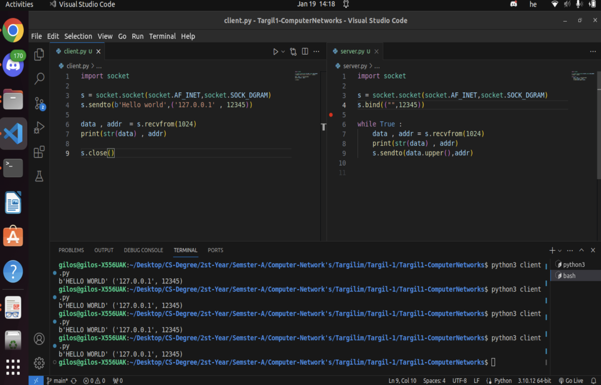
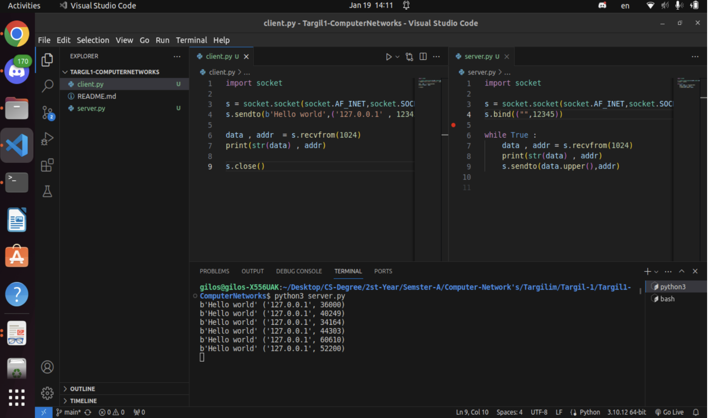

# UDP Client-Server Exercise

This project was completed as part of a university course on computer networks. The exercise demonstrates a simple implementation of a Client-Server communication model using the UDP protocol, where the objective is to create programs for both a client and a server that communicate with each other over UDP.

## ScreenShots:

*The client script sending a "Hello world" message to the server.*

*The server script receiving the message and sending a response.*

---

## Features
- **Client**: Sends a "Hello world" message to the server and waits to receive a response.
- **Server**: Listens for incoming messages on a specified port, prints the received message along with the client's address, and sends back the message in uppercase.

## Requirements
- Python 3.x

## Instructions
1. Run the `server.py` script on your machine to start listening on port 12345.
2. Run the `client.py` script to send a "Hello world" message to the server on the same port.
3. The server will respond with the message in uppercase, and the client will print the response.

> **Note**: For local testing, both the client and server should be on the same machine, using `localhost` (127.0.0.1) as the server address.

## Files
- `client.py`: Contains the client code that sends a "Hello world" message to the server and prints the server's response.
- `server.py`: Contains the server code that listens for incoming messages, processes them, and sends a response.

---
